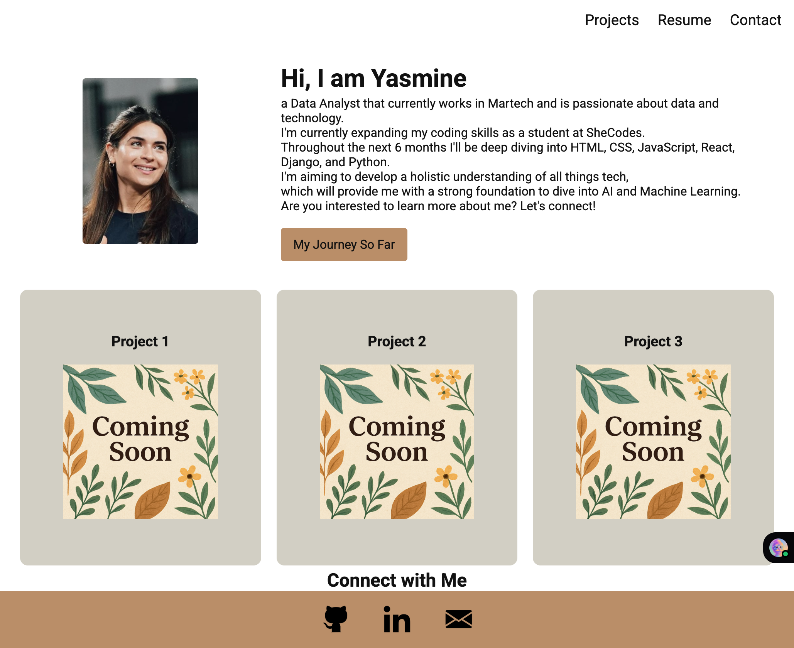
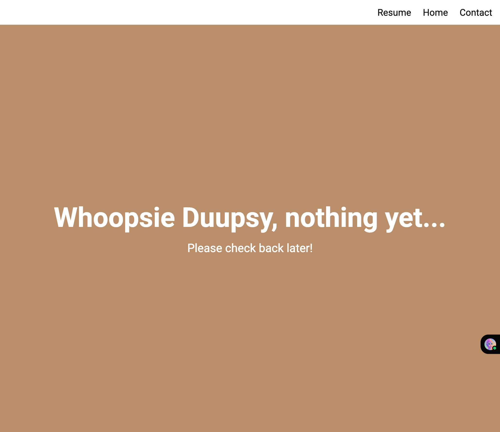
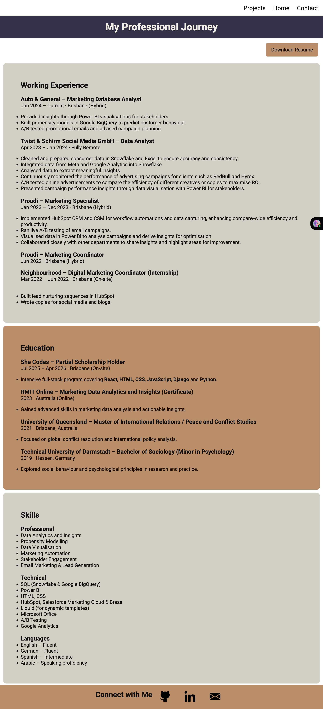
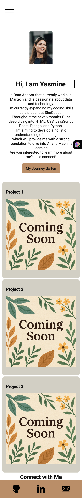

#  Yasmine Azzaoui - Portfolio Task
​
[My portfolio site](https://yasmine-azzaoui.github.io/)
​
## Project Requirements

### Content
 Add a short paragraph describing the features below. What aesthetic and technical choices did you make? 
- [X] At least one profile picture
- [X] Biography (at least 100 words)
<!-- No longer required? -->
- [-] Functional Contact Form
<!-- TBD -->
- [X] "Projects" section
- [X] Links to external sites, e.g. GitHub and LinkedIn.
​
### Technical
 Add a short paragraph describing the features below. What strategies or design decisions did you work from? 
- [x] At least 2 web pages.
- [x] Version controlled with Git
- [ ] Deployed on GitHub pages.
- [X] Implements responsive design principles.
- [X] Uses semantic HTML.

### Bonus (optional)
 Add a short paragraph describing the features below, if you included any. 
- [x] Different styles for active, hover and focus states.
- [ ] Include JavaScript to add some dynamic elements to your site. (Extra tricky!)
​
### Screenshots
> Please include the following:
> - The different pages and features of your website on mobile, tablet and desktop screen sizes (multiple screenshots per page and screen size).
> - The different features of your site, e.g. if you have hover states, take a screenshot that shows that.  
> 
> You can do this by saving the images in a folder in your repo, and including them in your readme document with the following Markdown code: 
#### DESKTOP ####
####  Image of my homepage

####  Image of my Project page

####  Image of my Resume page

#### MOBILE #####

####  Image of my Project page
.png)
####  Image of my Resume page
.png)

